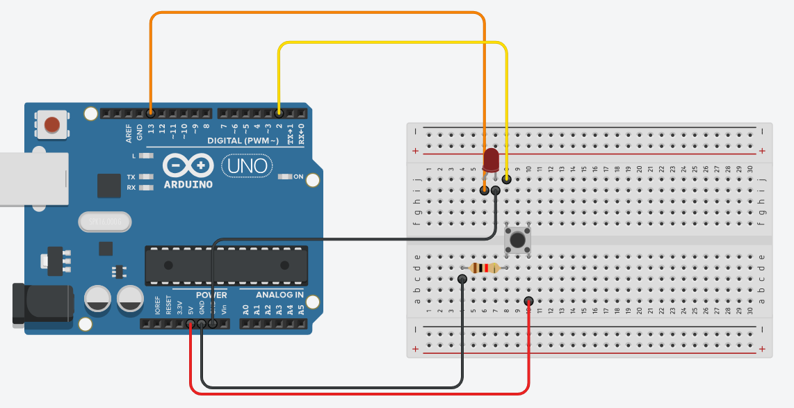

# Exemple 1 : LED + BOUTON

Dans cet exercice, vous disposez d’un bouton et d’une led. Et vous devez essayer d’allumer la led. Bien sûr, le but n’est pas de mettre en série le bouton avec la led, mais de relier le bouton à la carte et détecter les pressions.




```cpp
int button= 12;    //Initialisation du bouton sur le pin 12
int LED=  13;      

void setup() {
  pinMode(LED, OUTPUT);        //Initialisation de la LED en sortie
  pinMode(button, INPUT);      //Et le bouton en entrée
}

void loop(){ 

  if (digitalRead(button) == HIGH) {       //si on appuie sur le bouton     
    digitalWrite(LED, HIGH);               //On allume la LED
  }
  else {                                   //Sinon on éteint la LED
    digitalWrite(LED, LOW); 
  }
}
```