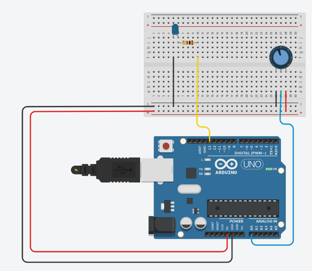

# Exemple 2 : Avec une entrée analogique 

Maintenant regardons les ports analogiques dans ce nouvel exercice, vous devrez allumer une led avec un potentiomètre.

::: danger

⚠️ Le potentiomètre contrairement au bouton fait varier la tension, il faudra donc utiliser une sortie analogique pour récupérer la tension exacte.

:::

Il n’y a pas besoin d’initialiser le potentiomètre.

Pour lire la valeur de la tension, on utilise la fonction :`analogRead(numero_du-pin)`

> Cette fonction renvoie une valeur entre 0 (soit 0V) et 1023 (soit 5V).
>




```cpp
int potentiomètre = 0;
int LED = 13; 

void setup()
{
  pinMode(LED, OUTPUT) ;             //LED est une sortie
}

void loop ()
{
  int val=analogRead(potentiomètre);
  if( val> 512) {                    //Si potentioState > 512 on allume led
   digitalWrite(LED, HIGH);
  }
  else {                             //Sinon on l'éteint 
    digitalWrite(LED, LOW);
  }
}
```

<iframe width="725" height="453" src="https://www.tinkercad.com/embed/ioKgvMuRn1D?editbtn=1" frameborder="0" marginwidth="0" marginheight="0" scrolling="no"></iframe>

👉 [Circuit design Potentio | Tinkercad](https://www.tinkercad.com/things/drtC1OEvBnH)
