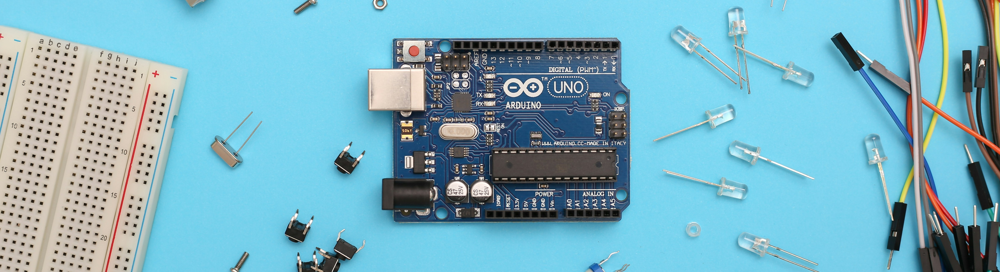

# Introduction à Arduino

### Histoire :

Arduino est une carte électronique issue d'un projet visant à réduire les coûts des projets d'école, celle de Design d'Interaction à Ivrea, en Italie. L'équipe a conçu cette carte et en a fait un projet open source, permettant ainsi à de nombreux passionnés d'électronique et de programmation de créer facilement des projets innovants et de partager leurs réalisations.

::: tip

💡 Le nom Arduino trouve son origine dans le nom du bar dans lequel l’équipe avait l'habitude de se retrouver. Arduino est aussi le nom d'un roi italien, personnage historique de la ville « Arduin d’Ivrée ». (https://fr.flossmanuals.net/arduino/historique-du-projet-arduino/)

:::

## TinkerCard pour une version en ligne

[Tinkercad | From mind to design in minutes](https://www.tinkercad.com/)

## Arduino IDE 2.2.1

[Software](https://www.arduino.cc/en/software)

- Pour Compiler un code sur Arduino IDE :

  Dans Tools puis dans Board, sélectionnez le nom de votre carte Arduino facilement trouvable sur votre carte.

  Et Sélectionner le port de la carte normalement automatiquement détecté.

  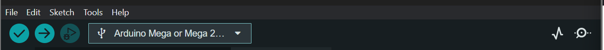

  Le premier bouton check permet de vérifier l’ensemble de votre code s'il est bon du point de vue syntaxique.

  Et le second bouton permet de transférer le code sur votre carte Arduino.

  Vous pouvez également télécharger des bibliothèques avec la barre de menu verticale à droite :

  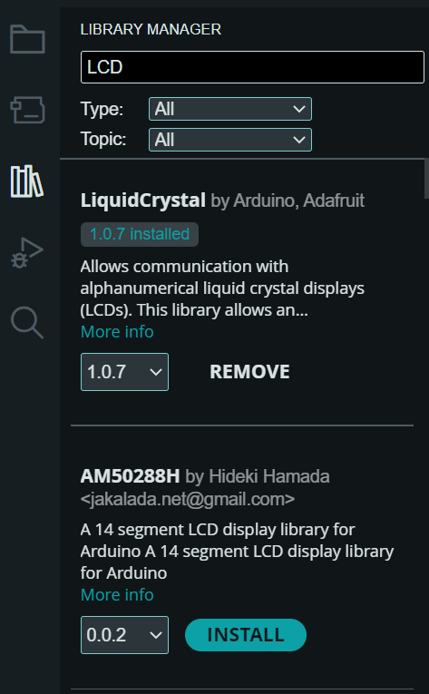

  ::: tip

    💡 Dans file/exemple, Arduino met à disposition les codes exemples de nombreux composants.

  :::

# Types de carte

Celle de base : **UNO**

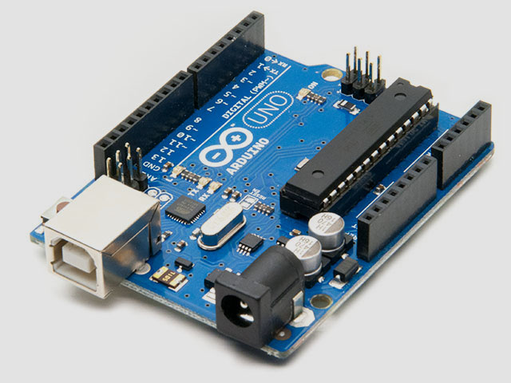

Avec plus de PIN : **MEGA**

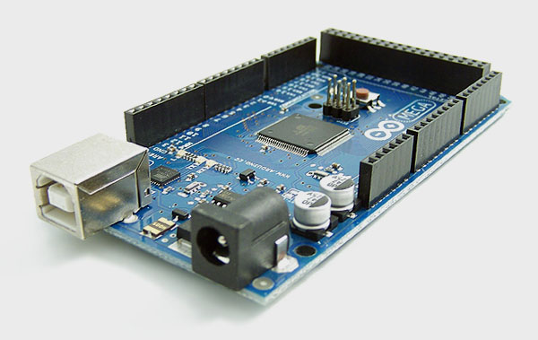

Ou plus petit : **NANO**

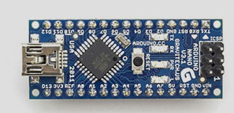

http://blewando.fr/elv/Promo2018/th14/pag6.html

## Les PINS 

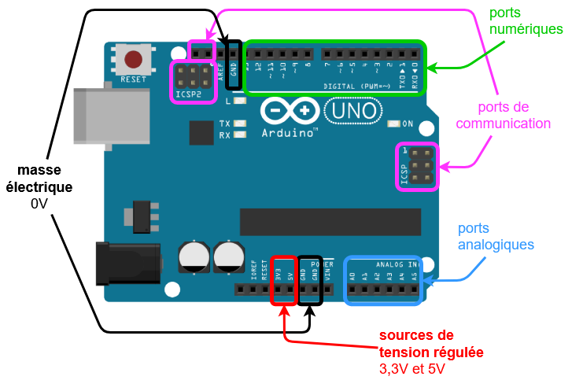

https://arduino.blaisepascal.fr/presentation/materiel/materiel-arduino/

Il y a deux types d’entrée sur une carte Arduino

- Il y a les **entrées numériques**, qui détectent tout signal électrique ”Allumer ou éteint” renvoyé par un capteur, comme un bouton.
    - Les ports PWM (notés~) permettent de faire varier la tension en jouant sur la fréquence, c'est-à-dire avoir une tension moyenne. Ces ports pourront être utilisés pour faire varier l tensions d’un moteur ou l’intensité d’une led.

  !https://passionelectronique.fr/wp-content/uploads/signal-pwm-arduino-rapport-cyclique-variable.jpg

- Et les **entrées analogiques** qui sont capables de lire la valeur d'une tension renvoyée par des capteurs tels que les potentiomètres, les capteurs d'humidité ou de température.
- Entrée RX et TX

## Autre Elements

| Image                                                               | Description   |
|---------------------------------------------------------------------|---------------|
| 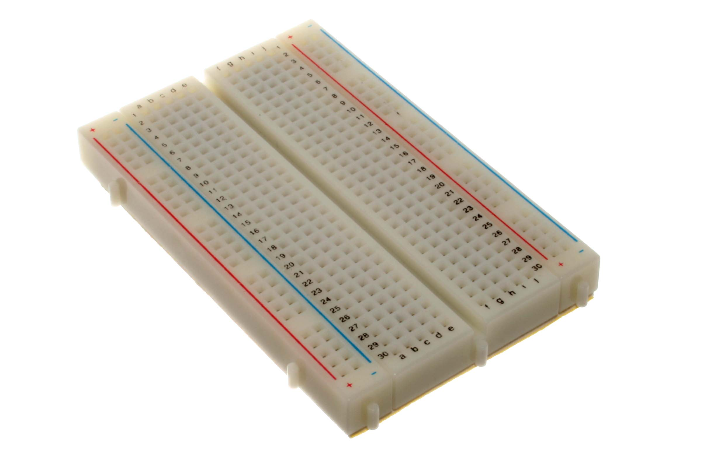       | Breadboard    |
| 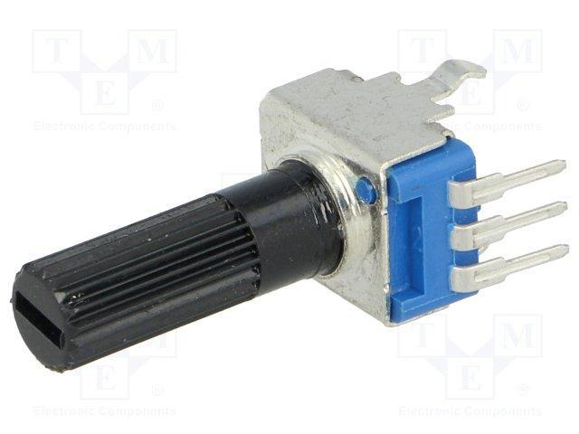 | Potentiomètre |
| 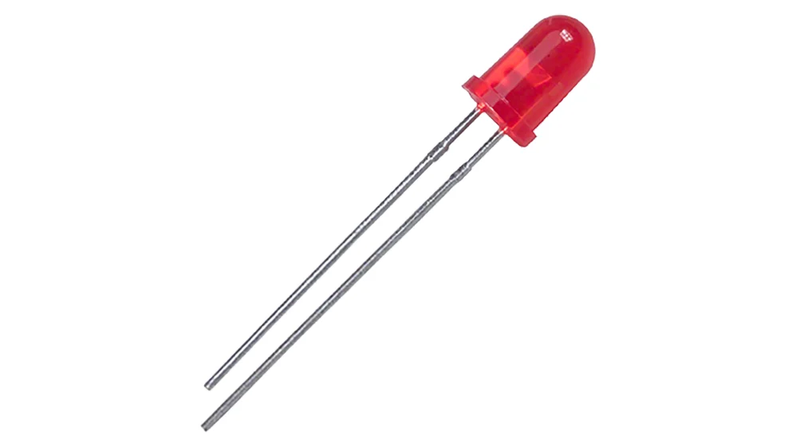                     | LED           |
| 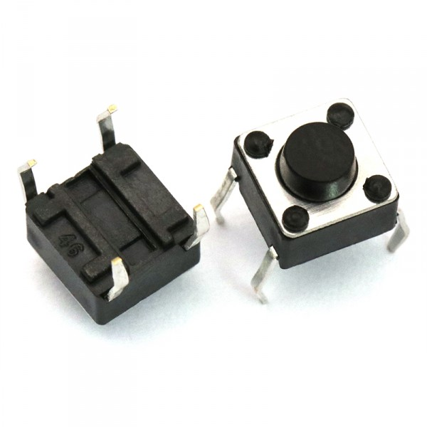               | Bouton        |

::: danger

⚠️ Le courant électrique dans une LED ne circule que dans un seul sens : de l'anode vers la cathode. L’anode étant la plus grande branche

Schéma interne d’un bouton :

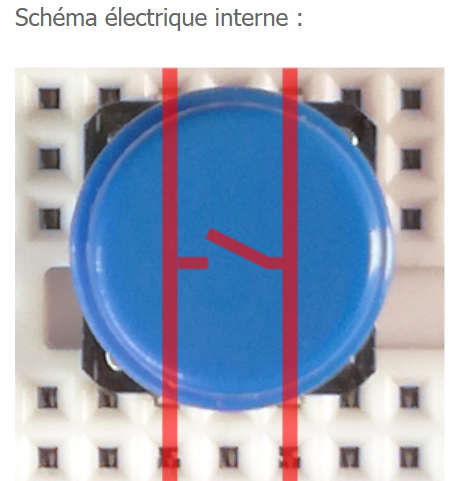

https://arduino.blaisepascal.fr/le-bouton-poussoir/

Schéma interne d’une breadboard :

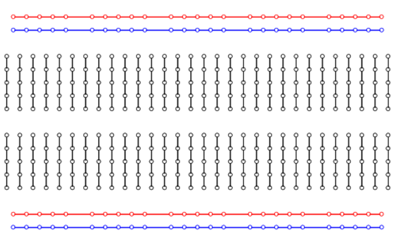

http://www.lafabriquediy.com/tutoriel/breadboard-ou-plaque-a-bidouille-1-89/

:::