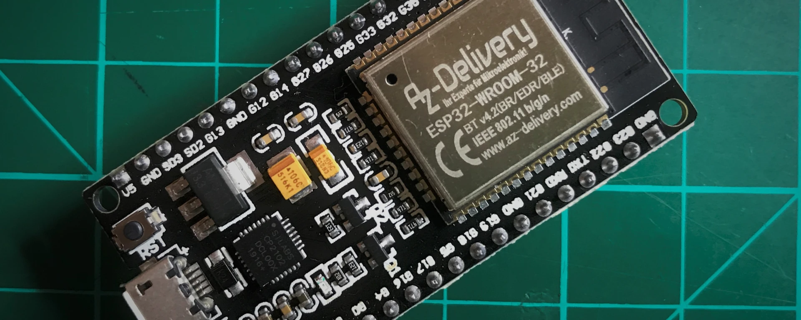

# ⚡ ESP32

## 🌟 Introduction

L'ESP32 est une carte de développement **Wi-Fi et Bluetooth** basée sur le module ESP32 d'Espressif. Cette carte est parfaite pour les projets IoT grâce à ses fonctionnalités avancées et sa puissance. Voici ses caractéristiques principales :

- **Processeur Xtensa dual-core** 32 bits cadencé à 240 MHz.
- **Mémoire :** 520 Ko de SRAM et 4 Mo de mémoire flash.
- **Connectivité :** Wi-Fi 802.11 b/g/n et Bluetooth 4.2 intégrés.
- **Compatibilité :** Programmable avec l'IDE Arduino ou MicroPython.

📌 **Différence clé avec Arduino Uno :** L'ESP32 fonctionne uniquement en 3.3V, contrairement à l'Arduino Uno (5V et 3.3V).

## ✨ Points forts de l'ESP32

- 🔗 Connectivité intégrée Wi-Fi et Bluetooth.
- 🌍 Idéal pour les projets **IoT**.
- 🛠️ Compatible avec **Arduino** et **MicroPython**.
- ⚡ Puissance : Processeur à 240 MHz (contre 16 MHz pour l'Arduino Uno).
- 🔋 Faible consommation d'énergie, parfait pour les appareils autonomes.

## 📌 Les PINs de l'ESP32

### 🖇️ Principales broches disponibles :

- **Alimentation :** Broches pour alimentation et masse.
- **VBAT :** Permet l'alimentation via une batterie.
- **VIN :** Alimentation externe.
- **GPIO :** (General Purpose Input/Output) Broches d'entrées/sorties numériques pour piloter des capteurs ou des actionneurs.
- **ADC :** Convertisseurs analogiques numériques pour lire des signaux analogiques.
- **Communication série :** UART, SPI, et I2C pour dialoguer avec d'autres composants.

[Lien vers l'ensemble des cartes ESP32 et leurs ports associés](https://github.com/thelastoutpostworkshop/gpio_viewer/blob/main/README.md)

### 🔘 Les boutons de contrôle :

- **RESET :** Réinitialise le module.
- **BOOT :** Démarre le module ou met à jour son firmware.

---

## ⚔️ ESP32 vs ESP8266 : Quelle carte choisir ?

| **Caractéristique**        | **ESP32**               | **ESP8266**              |
|----------------------------|-------------------------|--------------------------|
| **Processeur**             | Dual-core à 240 MHz     | Single-core à 80/160 MHz |
| **Mémoire**                | 520 Ko SRAM, 4 Mo flash | 160 Ko SRAM, 4 Mo flash  |
| **Wi-Fi + Bluetooth**      | Oui (Bluetooth 4.2)     | Wi-Fi uniquement         |
| **Nombre de GPIO**         | Plus de 30 broches      | Moins de 20 broches      |
| **Consommation d'énergie** | Moyenne                 | Faible                   |
| **Prix**                   | Plus élevé              | Plus économique          |

> 
> ESP32 à gauche, ESP8266 à droite.

## 🎯 Pourquoi choisir l'ESP32 ?

Avec l'ESP32, vous disposez d'une carte puissante et flexible pour développer vos idées, que ce soit pour un objet connecté, un système de contrôle automatisé ou une solution domotique. L'ESP32 vous offre la liberté de concevoir tout en maximisant les performances !

