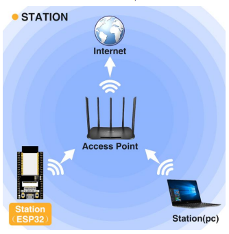
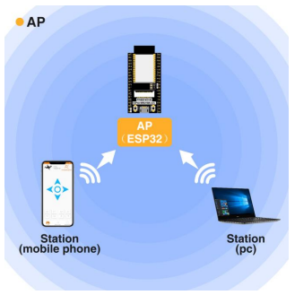

# Introduction à l'ESP32 et aux modes Wi-Fi 🌐

L'ESP32 est un microcontrôleur puissant, capable de se connecter à Internet via Wi-Fi. Il offre plusieurs modes de connexion qui permettent une grande flexibilité pour des projets IoT. Dans cette section, nous allons explorer :

1. 📡 **Mode Station** : L'ESP32 se connecte à un réseau Wi-Fi existant. 
2. 🌐 **Mode Point d'Accès (AP)** : L'ESP32 crée son propre réseau Wi-Fi.
3. 🔄**Mode Combiné** : L'ESP32 agit simultanément en tant que station et point d'accès.

::: warning Attention

N'utilisez pas le réseaux de l'école !
Si vous faites un partage de connexion avec votre téléphone vérifié que vous êtes bien en 4G (et pas 5G) et que vous utilisez la bande 2.4Ghz.

:::


## ESP32 en mode Station 📡



En mode station, l'ESP32 peut se connecter à un réseau Wi-Fi pour accéder à Internet ou communiquer avec d'autres appareils sur le réseau.

### Exemple de code : Connexion au Wi-Fi

```cpp{14,16}
#include <WiFi.h>

const char *ssid = "NomDuRéseau";
const char *password = "MotDePasse";

void setup() {
  Serial.begin(115200);
  delay(10);

  // Connexion au Wi-Fi
  Serial.println("\n\nConnexion au réseau : ");
  Serial.println(ssid);

  WiFi.begin(ssid, password);

  while (WiFi.status() != WL_CONNECTED) {
    delay(500);
    Serial.print(".");
  }

  Serial.println("\nWiFi connecté !");
  Serial.print("Adresse IP : ");
  Serial.println(WiFi.localIP());
}

void loop() {
  // 
}
```

## ESP32 en mode Point d'Accès (AP) 🌐



En mode point d'accès, l'ESP32 crée son propre réseau Wi-Fi, auquel d'autres appareils peuvent se connecter. C'est idéal pour des projets nécessitant une communication directe entre appareils.

### Exemple de code : Création d'un Point d'Accès

```cpp {18,19}
#include <WiFi.h>

const char *ssid = "NomDuRéseau";
const char *password = "MotDePasse";

IPAddress local_IP(192, 168, 1, 1);
IPAddress gateway(192, 168, 1, 1);
IPAddress subnet(255, 255, 255, 0);

void setup() {
  Serial.begin(115200);
  delay(10);

  // Création du point d'accès
  Serial.println("\n\nCréation du point d'accès : ");
  Serial.println(ssid);

  WiFi.softAPConfig(local_IP, gateway, subnet);
  WiFi.softAP(ssid, password);

  Serial.println("Point d'accès créé !");
  Serial.print("Adresse IP : ");
  Serial.println(WiFi.softAPIP());
}

void loop() {
  // 
}
```


## ESP32 en mode combiné : Station et Point d'Accès 🔄

En mode combiné, l'ESP32 agit à la fois comme une station connectée à un réseau existant et comme un point d'accès créant son propre réseau. Ce mode est utile pour des projets avancés comme les réseaux maillés.

### Exemple de code : Mode Combiné

```cpp
#include <WiFi.h>

const char *ssid = "NomDuRéseau";
const char *password = "MotDePasse";

const char *APssid = "NomDuRéseauAP";
const char *APpassword = "MotDePasseAP";

IPAddress local_IP(192, 168, 1, 1);
IPAddress gateway(192, 168, 1, 1);
IPAddress subnet(255, 255, 255, 0);

void setup() {
  Serial.begin(115200);
  delay(10);

  // Connexion au réseau existant
  Serial.println("\n\nConnexion au réseau : ");
  Serial.println(ssid);

  WiFi.begin(ssid, password);

  while (WiFi.status() != WL_CONNECTED) {
    delay(500);
    Serial.print(".");
  }

  Serial.println("\nWiFi connecté !");
  Serial.print("Adresse IP : ");
  Serial.println(WiFi.localIP());

  // Création du point d'accès
  Serial.println("\n\nCréation du point d'accès : ");
  Serial.println(APssid);

  WiFi.softAPConfig(local_IP, gateway, subnet);
  WiFi.softAP(APssid, APpassword);

  Serial.println("Point d'accès créé !");
  Serial.print("Adresse IP : ");
  Serial.println(WiFi.softAPIP());
}

void loop() {
  // 
}
```


#### Tiré de la documentation fournie par Freenove.com