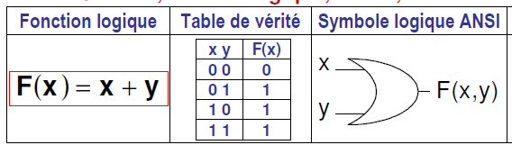
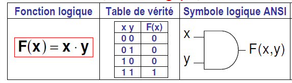
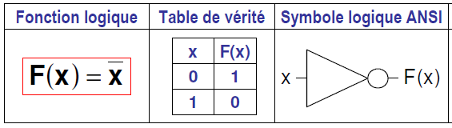
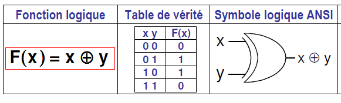
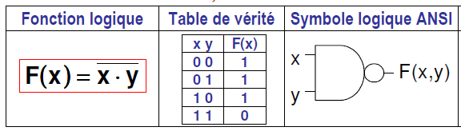
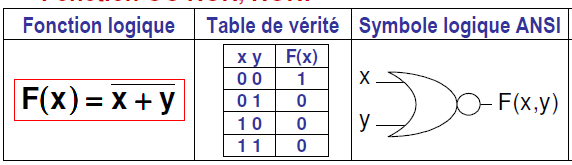
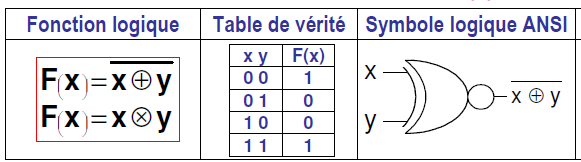

# Algèbre de Boole

## Fonction Logique Combinatoire

Les fonctions logiques combinatoires ne dépendent que des grandeurs d'entrées. Elles sont construites à partir de l’algèbre de Boole et peuvent être représentées sous 4 formes principales :

- **Disjonctive** : somme de produits
- **Disjonctive canonique** : somme de produits avec toutes les variables de la fonction
- **Conjonctive** : produit de sommes
- **Conjonctive canonique** : produit de sommes avec toutes les variables de la fonction

### Exemple :

#### Formes Disjonctives
- Disjonctive canonique :  
  $F(a,b,c) = \bar{a}b\bar{c} + \bar{a}bc + a\bar{b}\bar{c} $
- Disjonctive :  
  $F(a,b,c) = \bar{a}b\bar{c} + \bar{a}bc + ab $
- Rendre une forme canonique :  
  $F(a,b,c) = \bar{a}b\bar{c} + ab(c + \bar{c}) = \bar{a}b\bar{c} + ab\bar{c} + abc $

#### Formes Conjonctives
- Conjonctive canonique :  
  $F(a,b,c) = (a + b + c)(\bar{a} + b + c)(a + \bar{b} + \bar{c})$
- Conjonctive :  
  $F(a,b,c) = (a + b + c)(\bar{a} + b + c)$
- Rendre une forme canonique :  
  $F(a,b,c) = (a + b + c)(\bar{a} + b + c)(a + \bar{b} + \bar{c}) $

---

## Représentation d'une Fonction Logique

### Table de Vérité

La table de vérité est un tableau qui représente les valeurs de sortie d'une fonction logique en fonction des valeurs d'entrée.

#### Exemple :

| A | B | C | \( F(A,B,C) \) |
|---|---|---|----------------|
| 0 | 0 | 0 | 0              |
| 0 | 0 | 1 | 1              |
| 0 | 1 | 0 | 0              |
| 0 | 1 | 1 | 1              |
| 1 | 0 | 0 | 1              |
| 1 | 0 | 1 | 0              |
| 1 | 1 | 0 | 1              |
| 1 | 1 | 1 | 0              |

---

### Carte de Karnaugh

La carte de Karnaugh est un outil graphique qui permet de simplifier une fonction logique en combinant les termes adjacents.

::: danger Bit

Attention : le tableau de Karnaugh utilise le code de **Gray**, c'est-à-dire que les valeurs sont ordonnées de manière à ce qu'un seul bit change entre deux valeurs consécutives.

:::

#### Exemple :

|   | 00 | 01 | 11 | 10 |
|---|----|----|----|----|
| 0 | 0  | 1  | 1  | 0  |
| 1 | 1  | 0  | 1  | 0  |

## Table OR

| A | B | A OR B |
|---|---|--------|
| 0 | 0 | 0      |
| 0 | 1 | 1      |
| 1 | 0 | 1      |
| 1 | 1 | 1      |

## Table AND

| A | B | A AND B |
|---|---|---------|
| 0 | 0 | 0       |
| 0 | 1 | 0       |
| 1 | 0 | 0       |
| 1 | 1 | 1       |

## Table NOT

| A | NOT A |
|---|-------|
| 0 | 1     |
| 1 | 0     |

## Table XOR

| A | B | A XOR B |
|---|---|---------|
| 0 | 0 | 0       |
| 0 | 1 | 1       |
| 1 | 0 | 1       |
| 1 | 1 | 0       |

## Table NAND

| A | B | A NAND B |
|---|---|----------|
| 0 | 0 | 1        |
| 0 | 1 | 1        |
| 1 | 0 | 1        |
| 1 | 1 | 0        |

## Table NOR

| A | B | A NOR B |
|---|---|---------|
| 0 | 0 | 1       |
| 0 | 1 | 0       |
| 1 | 0 | 0       |
| 1 | 1 | 0       |

## Table XNOR

| A | B | A XNOR B |
|---|---|----------|
| 0 | 0 | 1        |
| 0 | 1 | 0        |
| 1 | 0 | 0        |
| 1 | 1 | 1        |

## Loi de De Morgan

- **Négation d'une conjonction** :  
  $$
  \neg (A \land B) = \neg A \lor \neg B
  $$
- **Négation d'une disjonction** :  
  $$
  \neg (A \lor B) = \neg A \land \neg B
  $$

## Les décodeurs et les multiplexeurs

### Décodeur

Un décodeur est un circuit combinatoire qui convertit un code binaire en un signal actif sur une seule sortie.

### Multiplexeur 

Un multiplexeur est un circuit combinatoire qui permet de sélectionner une entrée parmi plusieurs et de la transmettre à la sortie.

